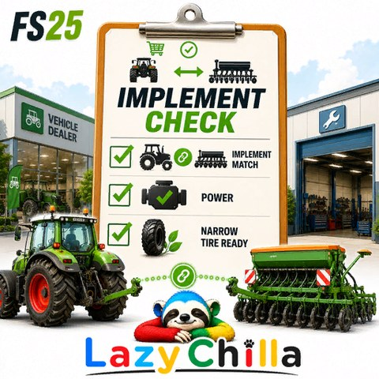
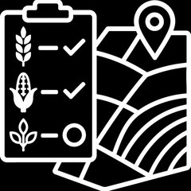

<h1 align="center">🚜 LazyChilla — FS25 Mods</h1>

<b>Human Concept. AI Code. Next Level Tools.</b>

Praktische Quality-of-Life-Mods für den <b>Landwirtschafts-Simulator 25</b> — kostenlos & quelloffen. 
Practical quality-of-life mods for <b>Farming Simulator 25</b> — free & open-source. 
📍 Luxembourg 🇱🇺

---

## 🇩🇪 Meine Mods &nbsp;·&nbsp; 🇬🇧 My mods

**Weniger Geklicke durch ESC-Menü und Karten — mehr spielen.**

Diese Funktionen fehlen mir ehrlich gesagt schon seit dem LS17. Ich war ständig auf der Suche nach Mods, die mir die wichtigsten Infos auf den Punkt bringen, statt minutenlang in ESC-Menüs zu recherchieren — aber einen Mod, der das für mich zufriedenstellend löst, habe ich nie gefunden. Als ich dann durch KI das Skripten für mich entdeckt habe, sind diese Mods entstanden: in erster Linie für mich selbst — und weil sie mir den Hof-Alltag leichter machen, teile ich sie mit der Community. Reine Komfort- und Anzeige-Hilfen, kein Cheat, kein Autopilot.

> _**Less clicking, less digging through menus, more playing.**_
> _Honestly, I've been missing these features since FS17. I kept looking for mods that get the key info straight to the point, instead of spending minutes researching in ESC menus — but I never found one that solved it to my satisfaction. When I discovered scripting through AI, these mods came to be: first and foremost for myself — and because they make daily farm life easier, I share them with the community. Pure comfort and display helpers, no cheats, no autopilot._

Ein Klick auf **⬇️ Download** führt zur neuesten Version. &nbsp;·&nbsp; A click on **⬇️ Download** takes you to the latest version.

| | Mod | Was er macht &nbsp;·&nbsp; What it does | |
|:--:|---|---|:--:|
|  | **Implement Check** | Gleicht Traktoren & Anbaugeräte nach PS ab: im Shop, als Live-Warnung beim Ankuppeln und mit Pflegereifen-Filter im Fahrzeugmenü.   _Matches tractors & implements by power — in the shop, as a live warning when attaching, and with a care-tyre filter in the vehicle menu._ | [⬇️](https://github.com/LazyChilla/FS25_ImplementCheck/releases/latest) |
|  | **Infinite Bale Consumables** | Ballennetz, Bindegarn und Wickelfolie werden nicht mehr verbraucht — nie wieder mitten im Feld nachladen.   _Bale net, twine and wrapping film are no longer consumed — never reload mid-field again._ | [⬇️](https://github.com/LazyChilla/FS25_InfiniteBaleConsumables/releases/latest) |
|  | **Forage Harvest Stop** | Der Feldhäcksler nimmt keine Frucht mehr vom Feld, sobald er nicht abladen kann — kein Ernteverlust, wenn der Abfahrer weg ist.   _The forage harvester stops taking crop the moment it can't unload — no harvest lost when the trailer is away._ | [⬇️](https://github.com/LazyChilla/FS25_ForageHarvestStop/releases/latest) |
|  | **DispoList** | HUD mit Lagerübersicht und den besten Verkaufspreisen — mit Live-Suche und Filtern nach Bereichen, Stationen und Presets; zeigt auch den Materialbedarf laufender Baustellen.   _HUD with stock overview and best selling prices — live search and filters by areas, stations and presets; also shows the material demand of active construction sites._ | [⬇️](https://github.com/LazyChilla/FS25_DispoList/releases/latest) |
|  | **Field Price Monitor** | Feldpreis-Übersicht mit Anbindung an die BetterContracts-Rabatte.   _Field price overview with BetterContracts discount integration._ | [⬇️](https://github.com/LazyChilla/FS25_FieldPriceMonitor/releases/latest) |
|  | **Seed Selector** | Scrollbare Saatgutauswahl direkt an der Sämaschine — alphabetisch sortiert und mit Rücksicht auf den Saatkalender (Aussaatzeiten).   _Scrollable seed selection right at the seeder — sorted alphabetically and aware of the planting calendar (sowing periods)._ | [⬇️](https://github.com/LazyChilla/FS25_SeedSelector/releases/latest) |
|  | **AutoDrive Extension** | Hängt eine Button-Leiste an das AutoDrive-HUD an: Fahrziele mit einem Klick anfahren, Werkstatt-Button, letzten Zustand merken & zurückspringen.   _Adds a button bar to the AutoDrive HUD: drive to destinations with one click, workshop button, remember & jump back to the last state._ | [⬇️](https://github.com/LazyChilla/FS25_AD_Extension/releases/latest) |
|  | **Go To Next Field** | Zeigt dir direkt vom Fahrersitz, welches Feld sich mit dem aktuell angehängten Gerät als nächstes bearbeiten lässt.   _Shows you, right from the driver's seat, which field can be worked next with your currently attached implement._ | [⬇️](https://github.com/LazyChilla/FS25_GoToNextField/releases/latest) |
|  | **Field Crop Planner** | Hilft dir, den Anbau in Richtung voller Autarkie für deine aktiven eigenen Produktionen zu optimieren.   _Helps you optimise your cropping toward full self-sufficiency for your active own productions._ | [⬇️](https://github.com/LazyChilla/FS25_FieldCropPlanner/releases/latest) |
|  | **FarmAssistant** &nbsp;`BETA` | Der Dach-Mod: bündelt deine täglichen Aufgaben aus dem ganzen Hof — Feldarbeit, Produktionen, Tiere, Baustellen, Kauf & Verkauf — und zeigt sie priorisiert auf einen Blick.   _The umbrella mod: bundles your daily tasks from across the whole farm — fieldwork, productions, animals, construction, buying & selling — and shows them prioritised at a glance._ | [⬇️](https://github.com/LazyChilla/FS25_FarmAssistant/releases) |

ℹ️ **FarmAssistant** ist noch **Beta** (Pre-Release) — Feedback willkommen. / **FarmAssistant** is still **beta** (pre-release) — feedback welcome.

---

🇫🇷 <b>Français</b>

 

Mods de confort pour **Farming Simulator 25** — tous gratuits et open-source. Le téléchargement se trouve sur la page de release de chaque mod.

- **Implement Check** — Compare tracteurs et outils par puissance : dans le magasin, alerte en direct à l'attelage, filtre pneus étroits dans le menu véhicules. → [Télécharger](https://github.com/LazyChilla/FS25_ImplementCheck/releases/latest)
- **Infinite Bale Consumables** — Filet, ficelle et film ne sont plus consommés. → [Télécharger](https://github.com/LazyChilla/FS25_InfiniteBaleConsumables/releases/latest)
- **Forage Harvest Stop** — L'ensileuse arrête de récolter dès qu'elle ne peut plus décharger — aucune perte quand la remorque est loin. → [Télécharger](https://github.com/LazyChilla/FS25_ForageHarvestStop/releases/latest)
- **DispoList** — ATH : stocks et meilleurs prix de vente ; recherche et filtres par secteurs, points de vente et préréglages ; affiche aussi les besoins en matériaux des chantiers en cours. → [Télécharger](https://github.com/LazyChilla/FS25_DispoList/releases/latest)
- **Field Price Monitor** — Aperçu des prix des champs avec intégration des remises BetterContracts. → [Télécharger](https://github.com/LazyChilla/FS25_FieldPriceMonitor/releases/latest)
- **Seed Selector** — Sélection de semences défilante sur le semoir — triée par ordre alphabétique et tenant compte du calendrier de semis. → [Télécharger](https://github.com/LazyChilla/FS25_SeedSelector/releases/latest)
- **AutoDrive Extension** — Ajoute une barre de boutons à l'ATH d'AutoDrive : rejoindre des destinations en un clic, bouton atelier, mémoriser et revenir au dernier état. → [Télécharger](https://github.com/LazyChilla/FS25_AD_Extension/releases/latest)
- **Go To Next Field** — Depuis le siège du conducteur, indique quel champ peut être travaillé avec l'outil actuellement attelé. → [Télécharger](https://github.com/LazyChilla/FS25_GoToNextField/releases/latest)
- **Field Crop Planner** — Aide à optimiser les cultures vers une autosuffisance complète pour tes propres productions actives. → [Télécharger](https://github.com/LazyChilla/FS25_FieldCropPlanner/releases/latest)
- **FarmAssistant** _(bêta)_ — Le mod chapeau : regroupe tes tâches quotidiennes de toute la ferme — travaux aux champs, productions, animaux, chantiers, achat & vente — et les affiche par priorité d'un coup d'œil. → [Télécharger](https://github.com/LazyChilla/FS25_FarmAssistant/releases)

🇮🇹 <b>Italiano</b>

 

Mod di comodità per **Farming Simulator 25** — tutti gratuiti e open-source. Il download si trova nella pagina di release di ogni mod.

- **Implement Check** — Confronta trattori e attrezzi per potenza: nel negozio, avviso dal vivo all'attacco, filtro pneumatici stretti nel menu veicoli. → [Scarica](https://github.com/LazyChilla/FS25_ImplementCheck/releases/latest)
- **Infinite Bale Consumables** — Rete, spago e pellicola non si consumano più. → [Scarica](https://github.com/LazyChilla/FS25_InfiniteBaleConsumables/releases/latest)
- **Forage Harvest Stop** — La trinciatrice smette di raccogliere quando non può scaricare — nessuna perdita se il rimorchio è lontano. → [Scarica](https://github.com/LazyChilla/FS25_ForageHarvestStop/releases/latest)
- **DispoList** — HUD: scorte e migliori prezzi di vendita; ricerca e filtri per aree, punti vendita e preset; mostra anche il fabbisogno di materiali dei cantieri in corso. → [Scarica](https://github.com/LazyChilla/FS25_DispoList/releases/latest)
- **Field Price Monitor** — Panoramica prezzi dei campi con integrazione degli sconti BetterContracts. → [Scarica](https://github.com/LazyChilla/FS25_FieldPriceMonitor/releases/latest)
- **Seed Selector** — Selezione sementi scorrevole sulla seminatrice — in ordine alfabetico e con riguardo al calendario di semina. → [Scarica](https://github.com/LazyChilla/FS25_SeedSelector/releases/latest)
- **AutoDrive Extension** — Aggiunge una barra di pulsanti all'HUD di AutoDrive: raggiungi destinazioni con un clic, pulsante officina, memorizza e torna all'ultimo stato. → [Scarica](https://github.com/LazyChilla/FS25_AD_Extension/releases/latest)
- **Go To Next Field** — Dal posto di guida, mostra quale campo può essere lavorato con l'attrezzo attualmente attaccato. → [Scarica](https://github.com/LazyChilla/FS25_GoToNextField/releases/latest)
- **Field Crop Planner** — Aiuta a ottimizzare le colture verso la piena autosufficienza per le tue produzioni attive. → [Scarica](https://github.com/LazyChilla/FS25_FieldCropPlanner/releases/latest)
- **FarmAssistant** _(beta)_ — Il mod ombrello: raccoglie i tuoi compiti quotidiani di tutta la fattoria — lavori nei campi, produzioni, animali, cantieri, acquisto e vendita — e li mostra per priorità a colpo d'occhio. → [Scarica](https://github.com/LazyChilla/FS25_FarmAssistant/releases)

🇵🇹 <b>Português</b>

 

Mods de conveniência para o **Farming Simulator 25** — todos gratuitos e de código aberto. O download está na página de release de cada mod.

- **Implement Check** — Compara tratores e alfaias por potência: na loja, aviso ao vivo ao engatar, filtro de pneus estreitos no menu de veículos. → [Descarregar](https://github.com/LazyChilla/FS25_ImplementCheck/releases/latest)
- **Infinite Bale Consumables** — Rede, fio e filme deixam de ser consumidos. → [Descarregar](https://github.com/LazyChilla/FS25_InfiniteBaleConsumables/releases/latest)
- **Forage Harvest Stop** — A ensiladeira para de colher assim que não consegue descarregar — sem perdas quando o reboque está longe. → [Descarregar](https://github.com/LazyChilla/FS25_ForageHarvestStop/releases/latest)
- **DispoList** — HUD: estoque e melhores preços de venda; busca e filtros por áreas, pontos de venda e predefinições; mostra também a necessidade de materiais das obras em curso. → [Descarregar](https://github.com/LazyChilla/FS25_DispoList/releases/latest)
- **Field Price Monitor** — Visão geral dos preços dos campos com integração dos descontos do BetterContracts. → [Descarregar](https://github.com/LazyChilla/FS25_FieldPriceMonitor/releases/latest)
- **Seed Selector** — Seleção de sementes rolável na semeadora — em ordem alfabética e considerando o calendário de sementeira. → [Descarregar](https://github.com/LazyChilla/FS25_SeedSelector/releases/latest)
- **AutoDrive Extension** — Adiciona uma barra de botões ao HUD do AutoDrive: ir a destinos com um clique, botão de oficina, memorizar e voltar ao último estado. → [Descarregar](https://github.com/LazyChilla/FS25_AD_Extension/releases/latest)
- **Go To Next Field** — Do assento do condutor, mostra qual campo pode ser trabalhado com a alfaia atualmente engatada. → [Descarregar](https://github.com/LazyChilla/FS25_GoToNextField/releases/latest)
- **Field Crop Planner** — Ajuda a otimizar o cultivo rumo à autossuficiência total para as tuas produções ativas. → [Descarregar](https://github.com/LazyChilla/FS25_FieldCropPlanner/releases/latest)
- **FarmAssistant** _(beta)_ — O mod chapéu: reúne as tuas tarefas diárias de toda a quinta — trabalhos no campo, produções, animais, obras, compra e venda — e mostra-as por prioridade num relance. → [Descarregar](https://github.com/LazyChilla/FS25_FarmAssistant/releases)

🇪🇸 <b>Español</b>

 

Mods de comodidad para **Farming Simulator 25** — todos gratuitos y de código abierto. La descarga está en la página de release de cada mod.

- **Implement Check** — Compara tractores y aperos por potencia: en la tienda, aviso en vivo al enganchar, filtro de neumáticos estrechos en el menú de vehículos. → [Descargar](https://github.com/LazyChilla/FS25_ImplementCheck/releases/latest)
- **Infinite Bale Consumables** — Red, cuerda y film ya no se consumen. → [Descargar](https://github.com/LazyChilla/FS25_InfiniteBaleConsumables/releases/latest)
- **Forage Harvest Stop** — La picadora deja de cosechar en cuanto no puede descargar — sin pérdidas cuando el remolque está lejos. → [Descargar](https://github.com/LazyChilla/FS25_ForageHarvestStop/releases/latest)
- **DispoList** — HUD: inventario y mejores precios de venta; búsqueda y filtros por áreas, puntos de venta y preajustes; muestra también la necesidad de materiales de las obras en curso. → [Descargar](https://github.com/LazyChilla/FS25_DispoList/releases/latest)
- **Field Price Monitor** — Resumen de precios de campos con integración de descuentos de BetterContracts. → [Descargar](https://github.com/LazyChilla/FS25_FieldPriceMonitor/releases/latest)
- **Seed Selector** — Selección de semillas desplazable en la sembradora — por orden alfabético y teniendo en cuenta el calendario de siembra. → [Descargar](https://github.com/LazyChilla/FS25_SeedSelector/releases/latest)
- **AutoDrive Extension** — Añade una barra de botones al HUD de AutoDrive: ir a destinos con un clic, botón de taller, memorizar y volver al último estado. → [Descargar](https://github.com/LazyChilla/FS25_AD_Extension/releases/latest)
- **Go To Next Field** — Desde el asiento del conductor, muestra qué campo se puede trabajar con el apero actualmente enganchado. → [Descargar](https://github.com/LazyChilla/FS25_GoToNextField/releases/latest)
- **Field Crop Planner** — Ayuda a optimizar el cultivo hacia la autosuficiencia total para tus producciones activas. → [Descargar](https://github.com/LazyChilla/FS25_FieldCropPlanner/releases/latest)
- **FarmAssistant** _(beta)_ — El mod paraguas: reúne tus tareas diarias de toda la granja — labores, producciones, animales, obras, compra y venta — y las muestra por prioridad de un vistazo. → [Descargar](https://github.com/LazyChilla/FS25_FarmAssistant/releases)

---

### 🐛 Fehler & Wünsche &nbsp;·&nbsp; Bugs & requests

Bitte über die **Issues** des jeweiligen Mods melden — **immer mit `log.txt`**. Kein Support über Kommentare auf Download-Seiten.
Please report via each mod's **Issues** — **always with `log.txt`**. No support via comments on download pages.

### 📜 Lizenz &nbsp;·&nbsp; License

Kostenlos nutzbar; Wiederverwendung mit Nennung von LazyChilla, kein Verkauf, gleiche Bedingungen. Details in der `LICENSE.md` des jeweiligen Repos.
Free to use; reuse with credit to LazyChilla, no selling, same terms. See each repo's `LICENSE.md`.
